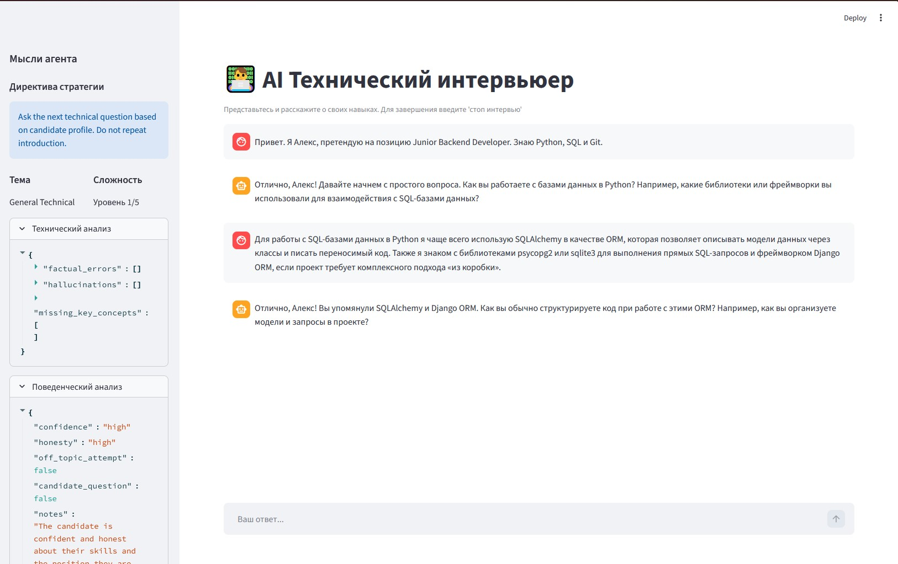
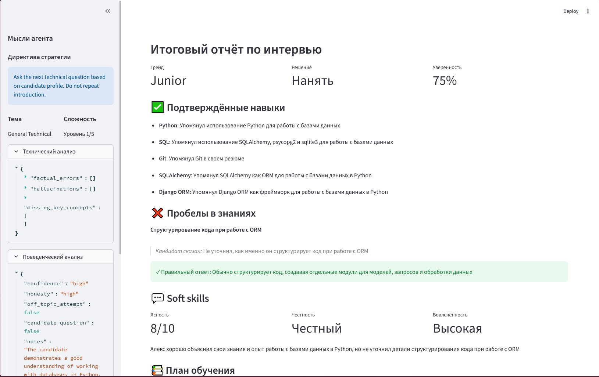

# Multi-Agent AI Interview Coach

Продвинутая система для проведения имитационных технических интервью, использующая возможности LLM и многоагентного подхода. Проект построен на базе **LangGraph**, что позволяет эмулировать сложный процесс мышления интервьюера, разделенного на специализированные роли.

---



---



---

## Установка и запуск

### 1. Подготовка
```bash
pip install -r requirements.txt
```

### 2. Настройка `.env`
```env
MISTRAL_API_KEY=your_key
LANGCHAIN_TRACING_V2=true # Для визуализации работы графа
LANGCHAIN_API_KEY=your_langchain_key
```

### 3. Запуск
```bash
streamlit run src/app.py
```

## Ключевые возможности

- **Многоагентная архитектура**: Интервью ведут не одна модель, а целая группа «экспертов», каждый из которых отвечает за свой аспект оценки.
- **Динамический сценарий**: Направление беседы и сложность вопросов меняются в реальном времени в зависимости от ответов кандидата.
- **Автоматический парсинг профиля**: Система извлекает данные о кандидате (имя, навыки, желаемая позиция) прямо из приветственного сообщения.
- **Глубокая аналитика**: После завершения интервью формируется подробный отчет с указанием грейда, подтвержденных навыков, пробелов в знаниях и персонализированным планом обучения.
- **Умное логирование**: Система сохраняет как видимый диалог, так и «внутренний голос» агентов, проходящий через процесс автоматической очистки и форматирования.

---

## Техническая архитектура

Проект реализован как ортогональная система агентов, координируемых через направленный граф.

### Агенты и их роли
1.  **Technical Evaluator** (`src/agents/technical.py`): Анализирует техническую точность ответов.
2.  **Behavioral Analyst** (`src/agents/behavioral.py`): Оценивает коммуникацию и soft skills.
3.  **Strategy Director** (`src/agents/strategy.py`): Определяет направление интервью на основе вердиктов предыдущих агентов.
4.  **Interviewer Agent** (`src/agents/interviewer.py`): Непосредственно взаимодействует с кандидатом.

### Механизм "Мышления" (Internal Reasoning)
Каждый агент в системе не просто генерирует текст, а проходит через этап структурированного анализа. Это реализовано с помощью **Pydantic моделей** и **JsonOutputParser**. 
- Перед тем как сформировать ответ, агенты "обсуждают" ответ кандидата во внутреннем поле `internal_thoughts`. 
- Это позволяет отделить логические выводы модели от текста, который увидит пользователь, гарантируя, что стратегия интервью строится на объективных фактах, а не на случайной генерации.

### Взаимодействие и Память
Агенты общаются друг с другом через общее состояние **`InterviewState`** (паттерн Blackboard):
- **Общая память**: Все сообщения (Human/AI) сохраняются в списке `messages`. Благодаря аннотации `Annotated[List[BaseMessage], operator.add]`, LangGraph автоматически объединяет новые сообщения с историей, обеспечивая контекстную память для всей группы агентов.
- **Передача контекста**: Технический и поведенческий агенты записывают свои выводы в поля `tech_analysis` и `behavioral_analysis`. Стратег считывает эти поля и формирует `strategy_directive` — конкретную инструкцию для Интервьюера.

### Граф состояний (LangGraph)
Цикл одного хода выглядит так:
1.  **Technical & Behavioral Node**: Параллельно (или последовательно) анализируют последний ответ.
2.  **Strategy Node**: Агрегирует аналитику и обновляет `interview_stage` и `difficulty_level`.
3.  **Interviewer Node**: Генерирует финальное сообщение, опираясь на полную историю и директиву стратега.

### Система логирования и Beautification

Система создает два типа отчетов:
- **`interview_log.json`**: Полный технический лог сессии.
- **`beautiful_interview_log.json`**: Человекочитаемая версия, создаваемая функцией `beautify_log_file` (`src/utils/formatter.py`):
    - **Очистка мыслей**: Из `internal_thoughts` удаляются все системные переносы строк (`\n`) и лишние пробелы, объединяя рассуждения в аккуратный текст.
    - **Структура**: Итоговый фидбек (`final_feedback`) преобразуется из JSON-строки в полноценный глубоко вложенный объект с форматированием.

---

## Структура проекта

- `src/agents/` — Логика "мышления" экспертов.
- `src/graph.py` — Описание логики переходов и связей между агентами.
- `src/state.py` — Структура общей памяти (State).
- `src/utils/formatter.py` — Постобработка и очистка логов.
- `src/profile_parser.py` — Интеллектуальное извлечение данных о кандидате.
